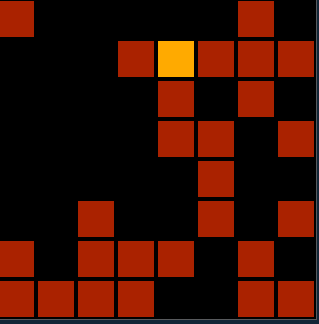

# pewpew-lightsout

- [pewpew-lightsout](#pewpew-lightsout)
  - [Important note when using VS Code for developing](#important-note-when-using-vs-code-for-developing)
  - [Play in pewmulator](#play-in-pewmulator)
    - [Logging in pewmulator](#logging-in-pewmulator)




Very simple implementation of the [Lights Out
game](https://en.wikipedia.org/wiki/Lights_Out_(game)) for [PewPew
10.2](https://pewpew.readthedocs.io/en/latest/pewpew10/overview.html) in
Python.

The goal of the puzzle is to switch all the lights off, preferably in as few
button presses (use button `X`) as possible.

## Important note when using VS Code for developing

[IntelliSense](https://code.visualstudio.com/docs/editor/intellisense) and
[Jedi](https://jedi.readthedocs.io/en/latest/) only working partially
probably because of pygame import handling. See:

- <https://github.com/davidhalter/jedi/issues/1393>
- <https://github.com/pygame/pygame/pull/413>

## Play in pewmulator

[pewmulator](https://github.com/pewpew-game/pew-pygame) is an emulator for
running PewPew games on desktop computers.

Just put `pew.py` from <https://github.com/pewpew-game/pew-pygame> next to
lightsout.py and then run:

```shell
python3 lightsout.py
```

### Logging in pewmulator

```python
import logging
logging.basicConfig(format='%(asctime)s - %(message)s', level=logging.DEBUG)
```

```python
logging.debug("x: %s",x)
logging.debug("y: %s",y)
```
